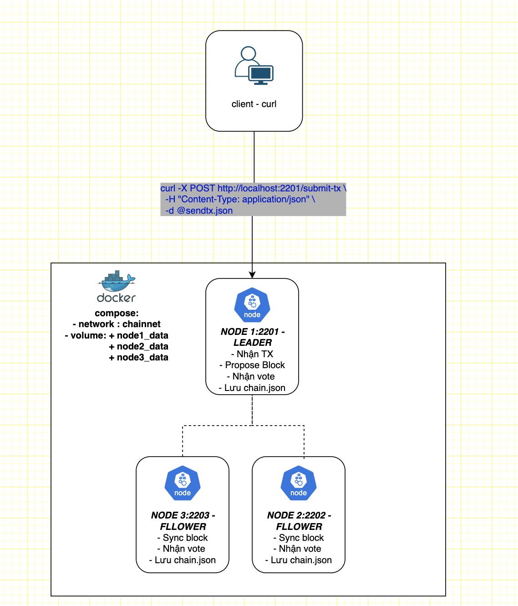

# 🧪 LAB_BLOCKCHAIN USING GOLANG
## ⚙️ Kiến trúc hệ thống

Hệ thống gồm **3 node blockchain** chạy bằng Docker Compose, mô phỏng một mạng phân tán nhỏ với leader-follower và cơ chế đồng thuận đơn giản.

### 🧱 Thành phần:

* **Node1 (Leader)**: Nhận giao dịch, tạo block, chờ vote từ follower.
* **Node2 (Follower)**: Nhận block, xác thực và gửi vote.
* **Node3 (Follower)**: Nhận block, xác thực và gửi vote.

Tất cả node kết nối trong cùng **Docker bridge network** tên `chainnet`. Mỗi node mount volume riêng để lưu dữ liệu blockchain (dưới dạng LevelDB).


---

## 📦 Volume Mapping

| Node  | Vai trò  | Volume       | Port |
| ----- | -------- | ------------ | ---- |
| node1 | Leader   | `node1_data` | 2201 |
| node2 | Follower | `node2_data` | 2202 |
| node3 | Follower | `node3_data` | 2203 |

## 💪 Cách chạy hệ thống

```bash
docker-compose up --build
```

---

## ↻ Quy trình hoạt động

### 1. Gửi giao dịch:

```bash
curl -X POST http://localhost:2201/submit-tx \
  -H "Content-Type: application/json" \
  -d @sendtx.json
```

### 2. Tạo block:

```bash
curl http://localhost:2201/propose-block
```

### 3. Đồng thuận:

* Leader gửi block đến follower.
* Follower vote "accept" nếu block hợp lệ.
* Leader nhận đủ ≥2 vote thì commit block.

---

## 🧪 Danh sách đầy đủ các API cần test

### 📤 Submit giao dịch

```bash
curl -X POST http://localhost:2201/submit-tx \
  -H "Content-Type: application/json" \
  -d @sendtx.json
```

### 🚀 Propose block (leader)

```bash
curl http://localhost:2201/propose-block
```

### 🔍 Kiểm tra trạng thái node

```bash
curl http://localhost:2201/ping
curl http://localhost:2202/ping
curl http://localhost:2203/ping
```

### 🧱 Lấy chiều cao block hiện tại

```bash
curl http://localhost:2201/latest-height
```

### 📦 Lấy block cụ thể

```bash
curl "http://localhost:2201/get-block?height=0"
```

### 🗳️ Gửi vote (dành cho follower test riêng)

```bash
curl -X POST http://localhost:2202/vote \
  -H "Content-Type: application/json" \
  -d '{"voter":"node2", "vote":"accept"}'
```

---

## 🔁 Khả năng phục hồi lỗi

* Dữ liệu chain được lưu trong LevelDB mount qua volume → không mất khi container chết.
* Nếu follower khởi động mà không có block → sẽ tự động **sync lại chain từ leader** qua HTTP API `/get-block?height=x`.
* Keep-alive log mỗi 10 giây để giám sát.
* `depends_on` đảm bảo leader khởi động trước.

---

## 🛠️ Tool CLI hỗ trợ user (local)

### Chức năng:

* `1` → Tạo ví (file JSON)
* `2` → Ký giao dịch (tạo sendtx.json)
* `3` → Xem nội dung & gửi TX lên node1

---

## 🔗 Tài nguyên khác

* **Merkle Tree**: Áp dụng trong block để kiểm tra toàn vẹn TX.
* **LevelDB**: Dùng làm storage thay vì file `chain.json`.
* **Consensus**: Majority vote 2/3.

---

## 👤 Thông tin ứng viên

**Đặng Thanh Lâm**

* 📞 Zalo/Phone: 0359001647
* 💼 Linkedin: [tlamabc](https://www.linkedin.com/in/tlamabc)
* 💻 Github: [tlamabc](https://github.com/tlamabc)
* ✉️ Email: [dangthanhlam1312@gmail.com](mailto:dangthanhlam1312@gmail.com)

